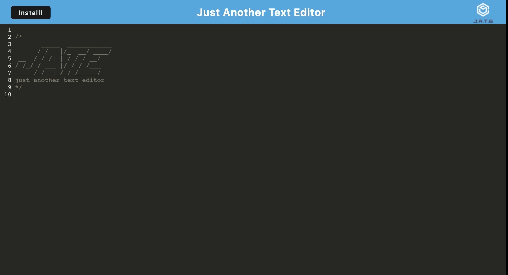

# Just-Another-Text-Editor

  ## Description
  This application allows the user to create beautified code snippets with or without internet connection, and stored for later user. 
  This project was built to demonstrate my knowledge of manipulating relational databses using SQL in Node.js. 
  This project was built to demonstrate my knowledge progressive web applications by turning an existing application into one which meets the PWA criteria. The finished app uses INdexedDB, Service Worker, and is bundled using webpack.

  ## Table of Contents
  [Description](#description)

  [Installation](#installation)

  [Usage](#usage)

  [Credits](#credits)

  [Testing](#testing)

  [License](#license)

  [Questions](#questions)

  ## Installation 
  Node.js

  ## Usage
  To use this application, users can visit the following link. This web application can be used offline, or installed on users local devices.
  https://still-forest-10139-ffea6895bd09.herokuapp.com/
    

  ## Credits
  N/A 

  ## Testing
  N/A

  ## License
  A short and simple permissive license with conditions only requiring preservation of copyright and license notices. Licensed works, modifications, and larger works may be distributed under different terms and without source code.
  [https://opensource.org/license/mit/](https://opensource.org/license/mit/)
  ## Questions
  Please reach out to rileysong01, at [https://github.com/rileysong01](https://github.com/rileysong01) or at rsong47@uwo.ca for additional questions. 